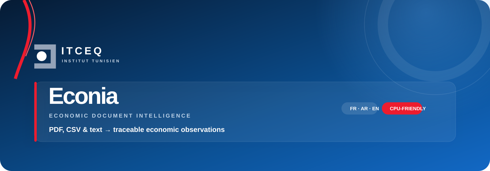

<div align="center">


# Econia
### Multilingual Economic Document Intelligence
**Transform economic documents into atomic, traceable and reviewable observations.**

[](#installation)
[](#run-econia)
[](#multilingual-processing)
[](#verified-results)
[](https://github.com/sarah-falehh/Econia/actions/workflows/tests.yml)
[](#architecture)
[](#engineering-principles)

[Overview](#overview) · [Screenshots](#product-tour) · [Architecture](#architecture) · [Evaluation](#verified-results) · [Install](#installation) · [Roadmap](#roadmap)
</div>

---

## Overview

Econia is a production-oriented Python/Streamlit workspace designed for the ITCEQ economic-analysis workflow. It reads PDF, CSV and pasted text in French, Arabic and English, then converts narrative passages and structured tables into **atomic economic observations** with source evidence, confidence and validation status.

```text
Geography + Indicator + Value + Unit + Period + Fact type
          + Source + Original sentence + Quality + Status
```

Econia uses an auditable hybrid pipeline: deterministic parsing, configurable economic ontologies, geometry-aware table reconstruction, finite-state temporal resolution and lightweight NLP. A large local LLM is not required.

> [!IMPORTANT]
> Passing tests does not prove universal reliability on every possible PDF. Econia reports ambiguity and preserves evidence for human review. Scanned PDFs still require OCR, and arbitrary chart data cannot always be reconstructed safely.

## Product tour

### Secure institutional access


### Document analysis workspace


### Operational overview


<table><tr><td width="50%"></td><td width="50%"></td></tr><tr><td align="center"><b>Traceable observations</b></td><td align="center"><b>Validated time series</b></td></tr></table>

### Multi-indicator and multi-geography comparison


## Capabilities

| Capability | Engineering behavior |
| --- | --- |
| Multiformat ingestion | PDF, CSV and pasted-text paths. |
| Multilingual extraction | French, Arabic and English, including RTL normalization. |
| Atomic events | One indicator, value, period and complete semantic context per event. |
| Clause-level binding | Coordinated values, indicators, periods, units and geographies. |
| Temporal resolution | Years, months, quarters, ranges, averages and relative periods. |
| Structured tables | PDF geometry, headers, rows, columns and analytical dimensions. |
| Geography modelling | Countries, regions, partners and economic groups such as PECO. |
| Numerical reconciliation | Each economic-looking number is extracted, reviewed or excluded with a reason. |
| Human validation | Review and correction with an auditable history. |
| Analytics | Time series, duplicate-period resolution, comparisons and exports. |

## Architecture

<div align="center"></div>

The stages remain separate so a correction in Arabic normalization, table reading or the interface cannot silently change French semantic binding:

1. **Ingestion** preserves pages and source identity.
2. **Normalization** retains lines, blocks, coordinates and reading order.
3. **Structure detection** separates narrative, headings, tables, charts, annexes and noise.
4. **Content inventory** traces clauses and numerical mentions.
5. **Segmentation** creates atomic propositions.
6. **Semantic binding** links indicator, value, unit, geography, sector and period.
7. **Context resolution** permits local continuity and expires it at topic boundaries.
8. **Validation** assigns confidence, warnings and status.
9. **Persistence and analytics** store events, revisions, series and comparisons.

## Reliability workflow

<div align="center"></div>

Every numerical mention receives a trace outcome: extracted, retained as **Needs review**, rejected with an explicit reason, or classified as documented noise. Chart ticks, page numbers, bibliographic years and econometric coefficients must not become observations.

## Atomic event model

<div align="center"></div>

> After increasing by 2.6% in 2023, real GDP grew by only 1.9% in 2024. Activity is expected to expand by 2.2% in 2025 before accelerating to 2.4% in 2026.

| Geography | Indicator | Value | Unit | Period | Fact type |
| --- | --- | ---: | --- | --- | --- |
| Context country | Real GDP growth | 2.6 | % | 2023 | Observed |
| Context country | Real GDP growth | 1.9 | % | 2024 | Observed |
| Context country | Real GDP growth | 2.2 | % | 2025 | Forecast |
| Context country | Real GDP growth | 2.4 | % | 2026 | Forecast |

“0.7 percentage point lower” is traced as a relative variation, not stored as another GDP level.

## Multilingual processing

Arabic processing is isolated behind language-dominance gates so RTL repairs cannot alter French selection. It handles Arabic-Indic and Western digits, displaced percentage/currency signs, Arabic economic terminology, ordered geography lists, shared periods and flattened RTL tables. Image-only documents require OCR.

## Verified results

These measurements are regression evidence, not a universal accuracy claim.

| Validation | Measured result |
| --- | ---: |
| Full regression suite before v6.1 visual changes | **225 passed** |
| French competitiveness report | **377 events**, protected semantic baseline preserved |
| Arabic Morocco synthetic PDF | **32 rows; 0 unresolved numerical tokens** |
| Arabic Algeria independent synthetic PDF | **44 rows; 0 unresolved numerical tokens** |
| Frozen regression GOLD | **14/14 exact events** |
| GOLD precision / recall / F1 / exact match | **100% / 100% / 100% / 100%** on this small fixed corpus only |

See [`evaluation/README.md`](evaluation/README.md) for matching rules. Never use an application-generated CSV as GOLD; freeze manually verified annotations and keep unseen documents in a holdout corpus.

```bash
python evaluation/evaluate.py --version v5.5
```

## Installation

Requirements: Python 3.11+, Windows/Linux/macOS, no GPU.

```bash
git clone https://github.com/sarah-falehh/Econia.git
cd Econia
python -m venv .venv

# Windows PowerShell
.venv\Scripts\Activate.ps1

# Linux / macOS
source .venv/bin/activate

python -m pip install --upgrade pip
pip install -r requirements.txt
```

## Run Econia

```bash
streamlit run app/dashboard.py
```

Windows users can also run `run_windows.bat`. The local SQLite database is created under `data/ecolinguatn.db`; the historical filename is retained for compatibility.

### Local development account

```text
Email: admin@itceq.tn
Password: Admin123!
```

Change this bootstrap credential before any shared or network deployment.

## Tests

```bash
python -m pytest -q
```

## Repository map

```text
.
├── app/
│   ├── dashboard.py          # Streamlit entry point
│   ├── services/             # Parsing, binding, validation, analytics
│   ├── views/                # Product screens
│   ├── ui/                   # ITCEQ/Econia identity and theme
│   └── models/               # Domain objects
├── data/models/              # Lightweight NLP artefact
├── docs/assets/              # Banner, diagrams and screenshots
├── evaluation/               # GOLD, matching and benchmark results
├── tests/                    # Permanent non-regression suite
├── .github/workflows/        # Automated regression checks
├── requirements.txt
└── run_windows.bat
```

## Engineering principles

- **Generalize by error family.** PDFs reveal weaknesses; they are not hard-coded targets.
- **Protect previous behavior.** Every correction passes the historical suite.
- **Trace every number.** Extract, review, reject with a reason or classify as noise.
- **Keep tables structured.** Detectable tables use geometry and headers.
- **Prefer explainable CPU-friendly methods.** Deterministic and lightweight NLP first.
- **Keep evidence attached.** Every event remains auditable from dashboard to source.

## Known limitations

- Scanned/image-only PDFs require confidence-aware OCR.
- Arbitrary charts cannot be reliably digitized from text layers alone.
- Broken or highly irregular table geometry may require review.
- The ontology is extensible but not exhaustive across every domain.
- The current GOLD corpus is too small for a universal reliability claim.

## Roadmap

- confidence-aware OCR for French, Arabic and English;
- larger manually annotated development and holdout corpora;
- document-level precision, recall and coverage dashboards;
- richer continuation-table and multi-level-header reconstruction;
- institution-specific ontology packages;
- CI, deployment hardening and secure bootstrap configuration.

## Project evolution

Econia is the rebuilt successor to the original [Eco-Lingua](https://github.com/sarah-falehh/Eco-Lingua) prototype. It replaces the earlier broad LLM/RAG positioning with an auditable engine centred on atomic evidence, structured tables, numerical reconciliation and regression safety.

## Author

Developed by [Sarah Faleh](https://github.com/sarah-falehh) for an ITCEQ-oriented economic document intelligence project.

See [CONTRIBUTING.md](CONTRIBUTING.md) before proposing an extraction change and [SECURITY.md](SECURITY.md) for responsible vulnerability reporting.

---
<div align="center"><b>Economic evidence should be usable — and defensible.</b></div>
